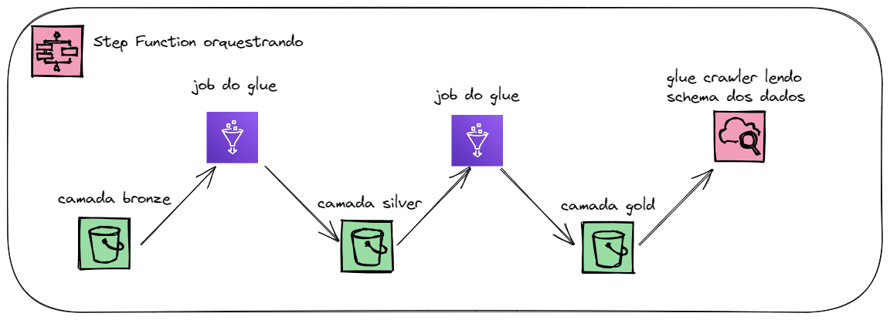

## Sobre o Projeto 
Minha solução para o teste técnico para vaga de Engenheiro de Dados na Foregon

### Construido Com
* [Python](https://www.python.org/)
* [Pyspark](https://spark.apache.org/docs/latest/api/python/)
* [AWS Glue](https://aws.amazon.com/pt/glue/)
* [AWS Step Functions](https://aws.amazon.com/pt/step-functions/?step-functions.sort-by=item.additionalFields.postDateTime&step-functions.sort-order=desc)
* [AWS Athena](https://aws.amazon.com/pt/athena/?whats-new-cards.sort-by=item.additionalFields.postDateTime&whats-new-cards.sort-order=desc)

### Estrutura de Diretórios
```sh
|--data #Pasta com o dados
	|--input #dados de entrada
|--sql #Pasta com queries das analises
|--terraform #arquivos .tf que utilizei para construir a infra
|--ETL #codigos da pipeline
	|--etl_silver.py #script que leva os dados da camada bronza para a silver
  	|--etl_user_products_gold.py #script que transforma os dados para analise de produtos dos usuarios e os joga para a camada gold 
  	|--etl_user_scores_gold.py #script que transforma os dados para calculo da quantidade de usuarios para o range de scores definido
```

### Arquitetura do Projeto


### Implementação
Para a implementação do projeto, utilizei Pyspark, pois é o mais adequeado para lidar com maiores volumes de dados. Rodei os códigos no ambiente do AWS Glue Jobs, um serviço de ETL serverless. Para possibilitar que o conjunto de dados torne-se insights para o time de analytics, construi um processo de ETL de descompacta os jsons, ou seja: um campo que seja da seguinte forma {'campo':{'outro_campo':'valor'}}, será transformado em uma coluna individual. Além disso, campos que contenham multiplos valores, como um array, serão transformados em linhas separadas, por exemplo: {'campo':[1,2,3]}, será transformado em 3 linhas individuais, visando facilitar o uso de SQL para analisar os dados, além de ter um ganho de performance. Por fim, orquestrei todas as fases de tratamento por meio de uma Step Function.

### Analises

#### Quantos usuários por dia temos?
```sql
SELECT count(DISTINCT _id)
	,date_trunc('day', "createdat_$date")
FROM user_data_products
GROUP BY date_trunc('day', "createdat_$date")
ORDER BY date_trunc('day', "createdat_$date");
```

#### Quantos usuários marcaram que possuem cada tipo de produto?
```sql
SELECT count(_id) as qtd_users
	,alreadyhaveproducts_producttype
FROM user_data_products
GROUP BY alreadyhaveproducts_producttype
ORDER BY alreadyhaveproducts_producttype
```

#### Quais usuários marcaram que possuem cada tipo de produto?
```sql
SELECT _id
	,alreadyhaveproducts_producttype
FROM user_data_products
ORDER BY alreadyhaveproducts_producttype;
```

#### Quantos usuários possuem scores nos ranges
```sql
SELECT score_group
	,"count"
	,ingestion_date
FROM user_data_score_grouped
ORDER BY (
		CASE 
			WHEN score_group = 'ATE 200'
				THEN 1
			WHEN score_group = 'DE 201 a 400'
				THEN 2
			WHEN score_group = 'DE 401 A 600'
				THEN 3
			WHEN score_group = 'DE 601 A 800'
				THEN 4
			WHEN score_group = 'ACIMA DE 800'
				THEN 5
			END
		);
```
